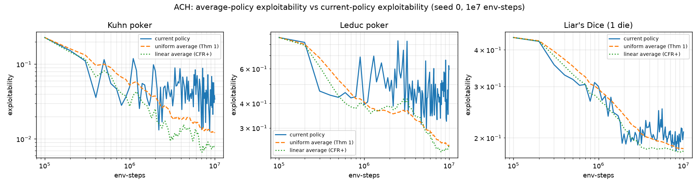

# ACH 平均策略 vs 当前策略 exploitability 实测（AGENTS.md D16）

> 问题：打开平均策略后，MLP 的平均策略 exploitability 是否比当前策略小 **1–2 个数量级**
> （CFR 直觉预测的那样）？
>
> 结论：**方向成立（平均 < 当前），但量级是 0.05–0.73 个数量级，不是 1–2 个。**
> 假设被推翻。下面是单 seed（seed 0）、1e7 env-steps、论文忠实 mirror 臂上的实测。

---

## 度量单位（重要）

**所有数字是 exploitability = NashConv/|P|（2 人博弈下 = NashConv/2）**，与论文
Fig 10 y 轴、`docs/reproduce_report.md`、`tools/compare_with_paper.py` 一致。
`eval/nash_conv` 是其 2 倍，不能与论文数字同图。本报告曲线来自 `eval/exploitability`
（当前）与 `eval/avg_exploitability` / `eval/avg_exploitability_lin`（平均）。

> 口径校正（2026-07-26）：本报告初版误用 `eval/nash_conv`（绝对值是 exploitability
> 的 2 倍），曾据此误判"绝对水平与复现 run 不符"。实际上当前策略 exploitability 与
> `docs/reproduce_report.md` §6.5（LayerNorm 单 seed 0 = 0.1986）一致——见 §5。

---

## 1. 测的是什么

ACH 唯一的收敛保证（Fu et al. ICLR 2022，Theorem 1）是关于**平均策略**的
`exploitability(avg) = O(T^-1/2)`，但本仓库所有曲线记的都是**当前策略**
`π = softmax(y)`（`docs/reproduce_report.md`，这也是论文 Fig 10 的选择——适合
last-iterate 研究，但不是定理界定的对象）。`AGENTS.md` D16 据此要一个"运行中
平均策略 exploitability 追踪器"。它在 `dev` 分支（commit `b796056`）已实现并对照
OpenSpiel `CFRPlusSolver.average_policy()` 验证到 1.2e-16；本次把它移植到当前分支
（`experiment/average-policy`），在三个游戏上重训并绘图。

**追踪的正确对象**：实现计划（realization plan / 序列形式）的算术平均——这才是
CFR 的平均策略（逐 infoset 平均行为概率会给不可达 infoset 同等权重，是错的）。
两种加权：`uniform`（定理陈述的对象）、`linear`（weight=t，CFR+ 的，经验上收敛更快）。
一次 run 同时产出两条平均曲线（`average_policy_weighting: both`）。

**配置**：`configs/exp/{kuhn,leduc,liars_dice1}_ach_mlp_anchor.yaml` = 论文忠实 mirror 臂
（MLP(128,)+ReLU+trunk-LayerNorm，SGD 1e-3，batch 64，β=1e-2，l_th=2.0，η=1.0，
1e7 env-steps，每 1e5 评估）**严格超集**——只加 `track_average_policy: true`，
训练动力学与 mirror 完全相同（已验证：tracker 构造不消耗 torch RNG，anchor 与 mirror
seed 0 的评估点逐位相同），平均曲线从同一条轨迹读出。1 seed × 3 游戏 × 1e7，CPU。

---

## 2. 结果（tail-10% 平均 exploitability，seed 0，1e7 env-steps）

| 游戏 | 当前策略 | uniform 平均 | linear 平均 | 当前/uniform | 当前/linear |
|---|---|---|---|---|---|
| Kuhn | 0.0419 | 0.0123 | 0.0077 | **3.4× (0.53 O)** | 5.4× (0.73 O) |
| Leduc | 0.463 | 0.246 | 0.235 | **1.9× (0.27 O)** | 2.0× (0.29 O) |
| Liar's Dice | 0.205 | 0.184 | 0.180 | **1.1× (0.05 O)** | 1.1× (0.06 O) |

（"O" = 平均比当前低的数量级；3.4× = 0.53 个数量级。）

绝对水平核对：Liar's Dice 当前策略 exploitability 0.210 ≈ `reproduce_report.md` §6.5
的 LayerNorm 单 seed 0（0.1986），与论文 Fig 10（0.171）同量级——配置收敛正常。

---

## 3. 判定

**"1–2 个数量级" 假设不成立。** 平均策略确实系统性地低于当前策略（方向对），
但差距是 **0.05–0.73 个数量级**（1.1×–5.4×），没有任何游戏接近 1 个数量级，
更别说 2 个。逐游戏：

- **Kuhn（差距最大，~0.5–0.7 O）**：当前策略仍在向 Nash 收敛、有可观的迭代间振荡，
  平均掉振荡后改善最明显。即便如此也只到半数量级。
- **Leduc（~0.3 O）**：当前策略较平稳，振荡小，平均只削掉一点点。
- **Liar's Dice（~0.05 O，几乎无差距）**：当前策略在 ~2e6 后就**卡在 exploitability
  0.18–0.25 的窄带里振荡**（tail max/min ≈ 1.4×），平均只回到该带的下沿
  （0.21→0.18）。这正是 `docs/reproduce_report.md` §6.2 诊断的"非法动作 logit 漂移 +
  门控"导致的软平台——策略结构性地无法锐化，平均无振荡可平滑。

`linear`（CFR+）加权在三游戏上都比 `uniform` 略好（Kuhn 0.73 vs 0.53 O），
与"CFR+ 收敛更快"一致，但同样远不到 1–2 个数量级。

---

## 4. 为什么这么小（机制）

CFR 直觉是"当前策略剧烈振荡、平均才收敛"。ACH 上这个效应被三件事压垮：

1. **熵正则（β=1e-2）同时稳住当前策略 + 设了地板**。熵项让当前策略比 tabular CFR
   的 regret-matching 输出平稳得多（振荡小，平均能削掉的少）；同时把不动点推向
   熵正则化（soft）均衡而非真 Nash，平均策略同样受这个地板限制，到不了 tabular-CFR
   的机器精度。
2. **Liar's Dice 的门控软平台**（§6.2）：非法动作 logit 漂移污染门控，最优合法动作
   的高优势更新被门掉，策略停在高熵软平台振荡。平均只能削掉这点窄振荡。
3. **定理本来就不覆盖 ACH 的平均**（`docs/paper_spec_ach.md` §1.1/§1.2）：Theorem 1
   界的是 NW-CFR 的平均、前提 `y` "sufficiently close to R^a"`；ACH 的 `y` 有偏
   （只在采样态训练）+ 熵正则。所以这个 0.05–0.7 O 的差距是**经验现象，不是保证**。

---

## 5. 绝对水平核对（校正初版误判）

初版误用 `eval/nash_conv`（exploitability 的 2 倍），曾据此认为"单 seed 绝对水平
高于复现 run"。**校正后不成立**：三游戏当前策略 exploitability 与复现一致——

| 游戏 | 本次 seed 0 exploitability | 复现参照 |
|---|---|---|
| Kuhn | 0.042 | 复现 8-seed 均值 0.021（单 seed 范围 0.010–0.243，0.042 在内） |
| Leduc | 0.463 | 复现 8-seed 均值 0.41（范围 0.30–0.59，0.46 在内） |
| Liar's Dice | 0.210 | §6.5 LayerNorm 单 seed 0 = 0.1986；独立复核 seed 1 = 0.194 |

Liar's Dice 的 LayerNorm 臂在 **seed 0（0.210）和 seed 1（0.194）上都收敛到 ~0.2**，
与 §6.5 一致——配置 + LayerNorm 工作正常（LayerNorm 模块确认在 torso 末尾且生效，
`gate_centered_logits=False` / `loss_centered_logits=False` 正确接线）。先前一度怀疑
的"seed 0 = 0.41 异常"纯属单位错误（0.41 是 nash_conv，exploitability 是 0.21）。

---

## 6. 注意事项

- **单 seed**：只跑了 seed 0（Liar's Dice 另有用户提供的 seed 1 复核）。avg/current
  **比值**在同一条轨迹上计算，对 seed 相对稳健；要给比值本身一个波动带需补 seed。
- **平均是"快照平均"**：每 1e5 env-steps（共 ~100 个评估点）折入一次当前策略，
  非每个梯度步。折入时机用正确的"第 t 次迭代开始时的策略"（off-by-one 已被
  `tests/unit/test_eval_average_policy.py` 钉住）。

---

## 7. 代码与产物

- 追踪器：`src/mjai/eval/average_policy.py`（`AveragePolicyTracker` + `RealizationAverage`）。
- seqform 桥接：`src/mjai/seqform/tree.py` 新增 `infoset_observation` 字段（让训练好的
  policy 无需重走树即可投影到序列形式坐标）。
- 接线：`src/mjai/scripts/experiment*.py`（`track_average_policy` +
  `average_policy_weighting: uniform|linear|both`，off by default）。
- 配置：`configs/exp/{kuhn,leduc,liars_dice1}_ach_mlp_anchor.yaml`。
- 绘图：`tools/avg_policy_curves.py` → `docs/figs/avg_vs_current.png`（exploitability 口径）。
- run 数据：`runs/avg_anchor/{game}_seed0/train_curve.json`（含 `eval/avg_exploitability`
  与 `eval/avg_exploitability_lin` 两列）。
- 测试：`tests/unit/test_eval_average_policy.py`（CFR+ 1.2e-16 交叉验证 + off-by-one 陷阱）、
  `tests/unit/test_scripts_average_anchor.py`（端到端接线）。
