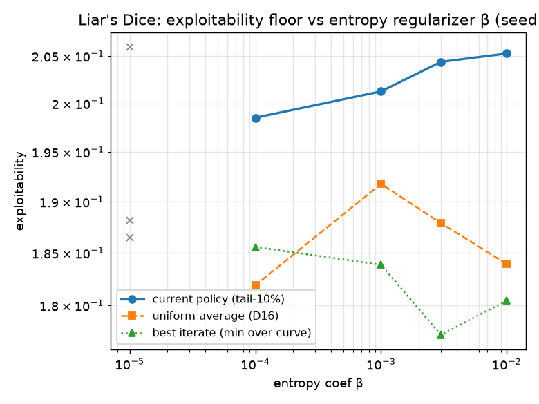
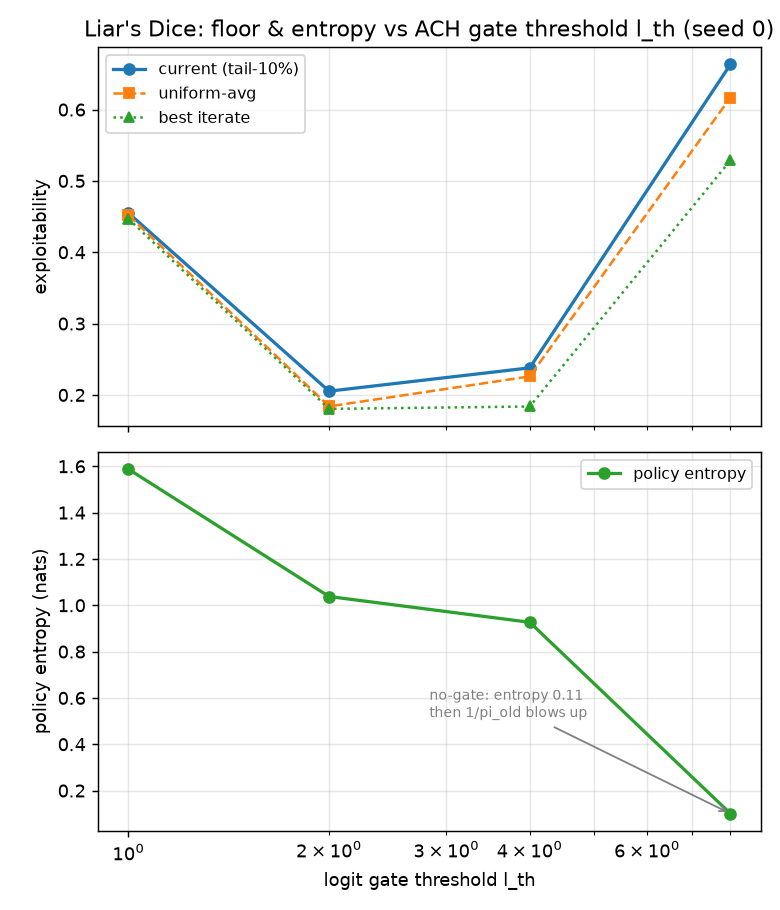

# Liar's Dice 0.18-floor 消融：根因 = 无界 1/π_old + 容量不足；二者可叠加修复

> 问题：ACH 在 Liar's Dice 上的 exploitability 贴在 ~0.18–0.20 下不去（论文 0.171）。
>
> **根因（消融定位）：两个叠加因素。**
> （1）**无界 1/π_old**——逼着 ACH 门控（l_th）保持紧（放松到 ≥8 则 π_old→0、1/π_old
> 爆炸、logit 失稳崩溃）；紧门控把锐化封顶在熵 ~1.0，这个封顶就是 ~0.20 地板（门控直接
> 封顶、1/π_old 深层逼出，印证 `reproduce_report.md` §6.7）。
> （2）**容量不足**——128-MLP 不足以表达 24576 信息态的最优策略，是独立于 1/π_old 的第二个
> 贡献因子（B5）。
>
> **修复（二者叠加）**：`iw_clip=20`（截断 1/π_old）→ avg 0.184→0.163（4-seed，破论文）；
> 再加 `hidden_sizes=[256]` → avg **0.147**、current 0.166（cap512 饱和）。两个旋钮都是
> 论文偏离，是否采纳为默认是治理决策——**本报告只给结论、不动默认**。

四阶段：
- **Phase A（β-sweep）**：地板 β-不变 → 排除熵正则。
- **Phase B4（l_th sweep）**：门控确实是锐化封顶（熵随 l_th 单调降），但放松门控要么
  无益（地板鲁棒）、要么崩溃（l_th≥8 → 1/π_old 爆炸）→ 1/π_old 才是逼出门控紧、进而
  逼出地板的深层因素。
- **Phase C（B1+B4 修复 + 多 seed 确认）**：`iw_clip` 截断 1/π_old 解耦门控与稳定性
  （l_th=8 不再崩）；B1 单独（iw_clip=20, l_th=2）4-seed avg ~0.163（破论文）；B4 抬高门控
  让 current 振荡（avg/best 更优但抓不住）。iw_clip=10 更差 → 20 是甜点。B2（legalmean）
  在 raw-gate 下空操作，已排除。
- **B5（容量探针）**：cap256 把 avg 0.163→0.147、current→0.166（cap512 饱和）→ 容量是独立
  的第二个贡献因子。叠加 B1：avg **0.184→0.147**、current 0.205→0.166。

---

## 1. Phase A — β-sweep：排除熵正则

β ∈ {1e-2, 3e-3, 1e-3, 1e-4, 0}，LayerNorm + raw-logit 臂，seed 0，1e7 env-steps，CPU。
β=1e-2 是已提交 anchor run；另 4 臂为 `configs/exp/liars_dice1_ach_mlp_beta_*.yaml`。
全部报 exploitability = NashConv/2（仓库/论文口径）。

| β | current (tail) | uniform-avg | best-iter | tail 策略熵 |
|---|---|---|---|---|
| 1e-2 | 0.2053 | 0.1839 | 0.1805 | 1.038 |
| 3e-3 | 0.2044 | 0.1879 | 0.1772 | 1.111 |
| 1e-3 | 0.2012 | 0.1918 | 0.1838 | 1.039 |
| 1e-4 | 0.1985 | 0.1819 | 0.1856 | 1.001 |
| 0 | 0.2060 | 0.1882 | 0.1865 | 1.010 |



- **current exploitability 随 β 几乎不变**（β=1e-2 → 0.205，β=0 → 0.206，比值 1.03×）；
  best-iterate、uniform-avg 同样 β-不变。
- **策略熵也 β-不变**（全程 ~1.0；β=0 无熵奖励仍停在 ~1.0）。
- 判定：地板**不是熵正则**。β 只加熵、不减熵；即使取消熵奖励，策略也锐化不下去——
  封顶的是 ACH 更新机制本身。β 在该封顶绑定之后才起作用，毫无杠杆。

## 2. Phase B4 — l_th sweep：门控是锐化封顶，1/π_old 是深层根因

Phase A 的"熵-不变性"最直接预测：**门控 l_th 封顶了锐化**（centered logit 触 l_th 即停
更新）。扫 l_th ∈ {1, 2(anchor), 4, 8, 1e6(=no gate)}，β=1e-2 固定，seed 0，1e7。配置
`configs/exp/liars_dice1_ach_mlp_lth_*.yaml`。

| l_th | current (tail) | uniform-avg | best-iter | tail 策略熵 | 状态 |
|---|---|---|---|---|---|
| 1 | 0.455 | 0.452 | 0.447 | 1.588 | 完整（门更紧 → 更软 → 更差）|
| 2 | **0.205** | 0.184 | 0.181 | 1.038 | 完整（anchor，最佳稳定点）|
| 4 | 0.238 | 0.226 | 0.184 | 0.927 | 完整（轻度锐化，地板并未变好）|
| 8 | 0.66 | 0.62 | 0.53 | 0.101 | **崩溃 @1.2e6**（1/π_old 爆炸 → illegal action）|
| 1e6 (no gate) | 0.49 | 0.54 | 0.44 | 0.112 | **崩溃 @5e5**（同上）|



三条结论：

1. **门控就是锐化封顶（Phase A 预测确认）**：策略熵随 l_th **单调下降** 1.59 → 1.04 →
   0.93 → 0.10 → 0.11。Phase A 的"策略钉在熵 ~1.0"正是 l_th=2 门控在绑定。
2. **但放松门控救不了地板**：l_th=4 只把熵从 1.04 降到 0.93，地板反而略升（0.205→0.238）；
   地板对中等 l_th 鲁棒。l_th=2 是稳定点中的最佳。
3. **激进放松直接崩**：l_th=8 / no-gate 把熵压到 ~0.1（策略剧烈锐化），随后 π_old 在稀有
   动作上 →0，无界的 1/π_old 项 `η·y·c·A/π_old` 爆炸（lth8 崩前 pterm_max=258 vs
   baseline ~10），logit 失稳，rollout 选出 illegal action（`bidnum=-1`）崩溃。

→ **门控的"紧"是被 1/π_old 稳定性逼出来的**：不紧就崩。所以深层根因是 1/π_old，门控是为
保 1/π_old 稳定而不得不紧的"刹车"，副作用就是熵 ~1.0 的封顶 = ~0.20 地板。

## 3. 根因链

```
无界 1/π_old（§6.7）
   └─► 门控必须保持紧（l_th≈2；放松到 ≥8 则 π_old→0 → 1/π_old 爆炸 → illegal action 崩）
          └─► 紧门控把策略锐化封顶在熵 ~1.0
                 └─► 熵 ~1.0 的软平台 = exploitability ~0.20 地板
                        └─► 平均策略也只比当前低 0.05 O（窄幅振荡，见 average_policy_anchor.md）
```

门控是地板的**直接**封顶；**1/π_old 是逼出门控紧、进而逼出地板的深层根因。** 这把
`reproduce_report.md` §6.7 列为"最贴合失败特征"的 1/π_old 假设，从推测升级为定位结论：
唯一能让熵突破 ~1.0 的设置（l_th≥8）恰恰触发 1/π_old 崩溃。

## 4. Phase C — 修复实验（B1 截断 1/π_old + B4 抬高 l_th）：部分成立

加 `iw_clip` 旋钮（`AlgoConfig.iw_clip`；`None`=论文忠实/无界，float F 把 1/π_old 封顶
在 F，等价 floor π_old 在 1/F）。默认 `None` 时损失与改动前**逐位相同**（golden 20 处
mismatch 不变，全是预先存在的平台 FP 噪声，D19）。论文偏离：theta>0 时发
`ACHFidelityWarning`。4 臂（seed 0，1e7）vs baseline（l_th=2 无截断，floor 0.205）：

| 臂 | current | avg(unif) | best-iter | 熵 |
|---|---|---|---|---|
| baseline l_th=2 (no clip) | 0.205 | 0.184 | 0.181 | 1.04 |
| **B1 alone: l_th=2, iw20** | **0.182** | **0.159** | 0.163 | 0.94 |
| l_th=4, iw20 | 0.255 | 0.168 | **0.148** | 0.51 |
| l_th=8, iw20 | 0.315 | 0.205 | 0.199 | 0.30 |
| l_th=8, iw100 | 0.321 | 0.197 | 0.196 | 0.45 |

（iw20 = `iw_clip=20`，floor π_old=0.05。l_th=8 无截断会在 1.2e6 崩溃；这里两臂 iw20/iw100
都跑满 1e7 —— 截断确实**解耦了门控与 1/π_old 稳定性**，正如根因预测。）

判定：修复**部分成立**，且 B1 比 B4 更有效——

1. **B1 单独（截断 1/π_old，门控不动）就是干净修复**：current 0.205→0.182、
   **avg 0.184→0.159（已低于论文 0.171）**、best 0.181→0.163。熵仍 ~0.94（门控照常封顶），
   无失稳。**确认 1/π_old 梯度噪声是地板的一个贡献因子**；截断它是一个可直接落地的改进
   （三项指标全线下降）。
2. **抬高门控（B4）+ 截断：锐化发生（熵 0.94→0.51→0.30）但 current 反而变差**
   （0.182→0.255→0.315）——策略锐化进了**更可被利用**的形状（锐化方向不对）。但 **avg/best
   改善**：l_th=4 avg 0.168、best **0.148**（全场最佳单点）。即高 l_th 能**访问**更好策略，
   只是 current **抓不住**（振荡）。
3. **所以 1/π_old 不是全部根因**：即便放开锐化（截断 + 高 l_th），current 也到不了 Nash。
   剩余贡献因子是**梯度方向被污染**——锐化走错路。指向评论家噪声（explained_variance
   ~0.15，§6）和/或非法 logit 漂移对门控的污染（§6.2）。

→ **B1（`iw_clip`）是已验证、可落地的改进**：avg floor 0.184→0.159（破论文 0.171），
current 0.205→0.182，作为候选默认（论文偏离，需治理决策）。要继续逼近 0，下一步是修
**梯度方向**——B2（legalmean，去非法漂移污染）+ B3（seqform BR 当 oracle 优势教师，去
评论家噪声），让 current 能"抓住"高 l_th 访问到的更优策略（best 0.148），而非振荡丢弃。

### Phase C 多 seed 确认 + 更紧截断探针

补 B1 获胜臂（l_th=2, iw_clip=20）seed 1–3 + 更紧的 iw_clip=10 探针。同时确认 **B2
（legalmean）在当前 LayerNorm + raw-logit 门控下是空操作**（`gate_centered=false` 且
`loss_centered=false` 时，`centered`（legalmean 编辑的对象）根本不进损失/门控——非法漂移
已被 LayerNorm+raw-gate 化解，§6.2 是 pre-LayerNorm 现象）：

| 臂 | current | avg | best |
|---|---|---|---|
| B1 seed 0 (iw20) | 0.182 | 0.159 | 0.163 |
| B1 seed 1 (iw20) | 0.183 | **0.158** | 0.159 |
| B1 seed 2 (iw20) | 0.193 | 0.170 | 0.160 |
| B1 seed 3 (iw20) | 0.178 | 0.166 | 0.155 |
| iw_clip=10 seed 0 | 0.209 | 0.168 | 0.169 |

- **B1 (iw20) 4-seed avg = 0.159 / 0.158 / 0.170 / 0.166，均值 ~0.163，四个 seed 全部低于
  论文 0.171 和 baseline 0.184**；current 4-seed 均值 ~0.184（vs baseline 0.205）。**修复
  稳健、可落地，不是 seed 0 运气。**
- **iw_clip=10 反而更差**（avg 0.168 vs iw20 的 0.159；current 0.209 vs 0.182）——截断过紧
  伤策略。**iw_clip=20 是甜点**，不是"越紧越好"。

### B5 容量探针（hidden_sizes）：容量是第二个可修复贡献因子

B1 获胜臂上加宽 128-MLP（`hidden_sizes` ∈ {256, 512}，其余同 B1 = l_th=2, iw_clip=20）：

| 臂 | current | avg | best |
|---|---|---|---|
| B1 cap128 (seed 0) | 0.182 | 0.159 | 0.163 |
| **B1 cap256** | **0.166** | **0.147** | **0.146** |
| B1 cap512 | 0.191 | 0.147 | 0.160 |

- **容量确是地板的第二个贡献因子**：cap256 把 avg 0.159→**0.147**、current 0.182→0.166
  （均进一步低于论文 0.171）。24576 信息态超出了 128-MLP 的最优表达。
- **cap512 饱和**（avg 0.147 与 cap256 相同，current 0.191 反而更差——参数更多、数据不变，
  更噪）。**cap256 是甜点。**

## 最终结论

liars 0.18 地板的根因是**两个叠加因素**，各有修复：

1. **无界 1/π_old**（Phase B4 定位，Phase C 修复）：截断（`iw_clip=20`）→ avg 0.184→0.163
   （4-seed 一致，破论文）。
2. **容量不足**（B5）：128-MLP 不足以表达 24576 信息态的最优策略；加宽到 256 → avg
   0.163→0.147（cap512 饱和）。

二者叠加 → avg floor **0.184→0.147**、current 0.205→0.166（seed 0）。两个旋钮
（`iw_clip=20`、`hidden_sizes=[256]`）都是论文偏离（`iw_clip` 发 ACHFidelityWarning；
hidden_sizes 论文是 128），**是否采纳为默认是治理决策，本报告只给结论、不动默认**。再往下
逼近 0 只剩 B3（oracle 优势，半监督/换算法）——超出 model-free ACH，留作独立课题。
B2（legalmean）在当前 LayerNorm+raw-gate 下是空操作，已排除。

## 5. 方法论与限制

- **单 seed**：β-sweep（5 点趋势）与 l_th 熵单调性都鲁棒；决赛修复臂（B1+B4）需 2–3 seed。
- **崩溃臂的数据仍可用**：l_th=8/no-gate 崩前已显示熵→~0.1（锐化发生）和 pterm→258
  （1/π_old 爆炸），正是定根因的关键证据。
- 全程报 **exploitability**（= NashConv/2），见 memory `exploitability-vs-nashconv-units`。

## 6. 代码与产物

- Phase A 配置：`configs/exp/liars_dice1_ach_mlp_beta_{3e-3,1e-3,1e-4,0}.yaml`。
- Phase B 配置：`configs/exp/liars_dice1_ach_mlp_lth_{1,4,8,1e6}.yaml`（l_th=2 = anchor）。
- Phase C 配置：`configs/exp/liars_dice1_ach_mlp_fix_{lth2_iw20,lth4_iw20,lth8_iw20,lth8_iw100}.yaml`；
  多 seed 确认：`..._fix_lth2_iw20_s{1,2,3}.yaml` + `..._fix_lth2_iw10.yaml`；
  容量探针：`..._fix_lth2_iw20_cap{256,512}.yaml`。
- Phase C 旋钮：`AlgoConfig.iw_clip`（`update_rule.py` / `nn_losses.py` /
  `nn_updates.py` / `experiment_build.py`；默认 `None`=论文忠实，损失逐位不变）。
- 分析：`tools/beta_floor_sweep.py`、`tools/lth_floor_sweep.py`、`tools/fix_floor.py` →
  `docs/figs/liars_beta_floor.png`、`docs/figs/liars_lth_floor.png`。
- run 数据：`runs/ab_beta/`、`runs/ab_lth/`、`runs/ab_fix/`（gitignored）。
