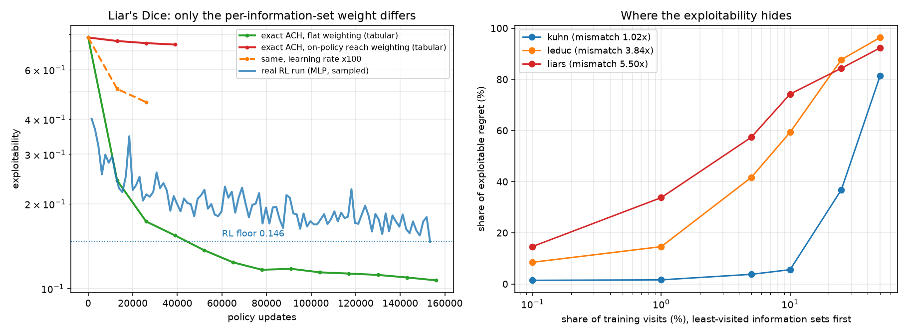

# Liar's Dice 残余地板（0.146）的根因：on-policy 权重的动态范围，不是估计误差

> 前情：`docs/liars_floor_ablation.md` 把 0.184 的地板拆成两个可修因子（无界 1/π_old
> → `iw_clip=20`；容量不足 → `hidden=256`），降到 **avg 0.147 / current 0.166**。
> `docs/liars_machine_precision.md` 用蒸馏证明这是**算法**地板不是**表示**地板
> （同一个 MLP 监督拟合 Nash 可达 0.0033，低 45×），并逐一排除了 critic（4 种改法）
> 与 batch size（2 套口径）。剩下的结论只是一个标签：**"ACH 策略梯度算法本身"**。
>
> **本报告把那个标签换成一个机制，并给出因果证据。**
>
> **根因：ACH 从 on-policy rollout 学习，每个信息态拿到的梯度权重正比于 ρ(I)＝一局
> 自对弈访问它的概率。这个权重的\*\*排序是对的\*\*，但它的\*\*动态范围横跨 20.8 个数量级\*\*
> ——有效训练到的信息态只有 40 个（共 24576），中位数 ρ = 4.7e-10。**
>
> - **跨游戏**：有效信息态数 effN(ρ) 在三个游戏上分别是 **9.3 / 58.7 / 39.9**
>   （kuhn / leduc / liars），而 |S| 是 12 / 936 / 24576 —— **绝对覆盖量几乎不随博弈
>   规模增长**，占比从 77.9% 塌到 **0.16%**。这就是同一个算法在 Kuhn 上没问题、在
>   liars 上不行的原因。
> - **因果证据**：在剥掉采样噪声、critic 误差和函数逼近的**精确动力学**里，
>   **只把权重从 reach 换成 uniform**，同预算下 exploitability 从 **0.737 → 0.154**。
>   把全局学习率放大 100 倍**不能**替代（同预算只到 0.512）。
> - **修法不是重排序，是压缩**（§7）：保持 ρ 的排序、只把指数降到 0.5，蒸馏
>   exploitability 从 uniform 的 0.161 降到 **0.0092**（17×）；而换成反事实 reach 排序
>   反而更差（0.175）。
> - **反直觉推论**：MLP 的跨信息态泛化不是误差来源，而是**把 ACH 从退化采样分布里
>   救出来的机制**——精确表格版（完美优势、无逼近误差、有效步长还大 3.36 倍）在同
>   预算下比带噪的 MLP RL run **差 3.5 倍**。
>
> ⚠️ **本报告初版的归因理由已修正（2026-07-28）**：初版说"最佳响应按反事实 reach
> 收割误差，ρ 多出的 own_reach 因子就是缺陷"。**那是错的**——见 §7.1 的推导与
> §7.2 的实验。ρ 的排序才是对的，问题在动态范围。所有**测量**不变，改的是解释。
>
> 度量单位：exploitability = NashConv/2。Theorem 1 引自 `docs/paper_spec_ach.md`
> §1.1 的转录（PDF 不在工作区，本次未联网复核，用户裁定）。

---

## 1. 工具：精确 ACH 动力学（无采样、无 critic、无函数逼近）

以往每一次消融都是在**估计机制**里做的（critic 好一点、batch 大一点、网宽一点）。
本次换一个方向：把估计机制**全部拿掉**，只留更新规则本身。

`tools/exact_ach.py` 在信息态上维护一张 float64 logit 表，执行 ACH 的**期望**更新：

```
y  <-  y + lr * rho * ( eta * c * A  -  beta * pi * (log pi + H) )
```

推导：论文逐样本损失是 `-c·η·y(a)/π_old(a)·A(a)`（Eq. 29 p24），对 logit `y_j` 的
梯度只在被采样的动作上非零，为 `-c·η·A_j/π_j`；对 `a ~ π` 取期望，**`1/π_old` 恰好
与采样概率相消**，剩下 `-η·c_j·A_j`。熵项贡献 `+β·π_j·(log π_j + H)`。每个信息态的
权重就是一局 rollout 访问它的概率 ρ(I)——这一项正是"采样算法的期望"与"全树扫描变体"
的分界。

于是这份动力学等价于：**无限 batch + 完美 critic + 表格化参数**的 ACH。
在这里还存在的地板，是 ACH 更新规则的性质，与任何估计器无关。

### 1.1 精确优势的验证（不是估计，是精确值）

优势与访问概率都由 autograd 在精确多线性收益上求出（一次前向、三次 vjp）：

```
g[I,a]   = d E[u_p] / d behaviour[I,a]  = own_reach(I) * CFV(I,a)
rho[I,a] = 同一导数、但把所有终局收益换成 1 = own_reach(I) * cfreach(I)
A(I,a)   = ( g[I,a] - sum_b pi_b g[I,b] ) / rho(I)        <- own_reach 解析相消
```

三项独立验证：

| 检查 | 结果 |
|---|---|
| Kuhn 中 P1 每局恰好行动一次 ⟹ Σ_I ρ(I) = 1 | **1.000000000000** |
| 均匀策略下 P0 的 Σρ = 1 + P(pass,bet) = 1.25 | **1.250000000000** |
| 在 Nash 上支撑集内优势应为 0 | **max \|A\| = 1.665e-16** |
| 在 Nash 上支撑集外优势应严格为负 | **−1/6（精确）** |
| ρ 必须与动作无关（同一行各合法动作相同） | 逐步断言，最大离散 < 1e-9 |
| 该工具算出的 checkpoint exploitability vs 训练曲线记录值 | **0.14637 vs 0.14637** |

---

## 2. 权重的测量：有效覆盖不随博弈规模增长

`tools/reach_mismatch.py` 对同一个策略算两种加权下的可改进量：

```
regret(I) = max_a A(I,a)
R_sampled = sum_I rho(I)     * regret(I)
R_counter = sum_I cfreach(I) * regret(I)
effN      = (sum_I w)^2 / sum_I w^2          <- 该权重有效训练到的信息态数
```

对三个游戏各自训练好的策略（liars 用 `ab_fix/..._cap256_seed0` 末 checkpoint，
Kuhn/Leduc 用 `avg_anchor/*_seed0` 末 checkpoint）：

| 游戏 | \|S\| | Δ（收益幅度） | expl | **expl/Δ** | **effN(ρ)** | **effN/\|S\|** | 失配比 | ρ 中位数 | bottom 1% 访问量持有的 regret |
|---|---|---|---|---|---|---|---|---|---|
| Kuhn | 12 | 4.0 | 0.0349 | **0.0087** | **9.3** | **77.9%** | 1.02× | 1.8e-1 | 1.6% |
| Leduc | 936 | 26.0 | 0.4892 | **0.0188** | **58.7** | **6.3%** | 3.84× | 6.6e-4 | 14.6% |
| **Liar's Dice** | **24576** | 2.0 | 0.1464 | **0.0732** | **39.9** | **0.16%** | 5.50× | **4.7e-10** | **33.8%** |

`effN = (Σw)²/Σw²`（participation ratio），即该权重**有效训练到的信息态数**。

三条读数：

1. **on-policy 权重的有效覆盖不随博弈规模增长**：effN 的绝对值在三个游戏上都是几十
   （9.3 / 58.7 / 39.9），而 |S| 差 2000 倍。占比因此从 Kuhn 的 77.9%（整个博弈基本
   都在训练里）塌到 liars 的 **0.16%**。**这一条就是"为什么同一个算法在 Kuhn 上没
   问题、在 liars 上不行"的答案。**
2. **liars 的访问分布是退化的**：ρ 中位数 4.7e-10，97.2% 的信息态 ρ < 1e-4，动态范围
   **20.8 个数量级**——由 own_reach（10.8 个数量级）与 cf（10.7 个数量级）**两个因子
   相乘**得到，二者贡献几乎相等。
3. **收益归一化后的地板与 effN 占比同序**（0.0087 / 0.0188 / 0.0732 对
   77.9% / 6.3% / 0.16%）。

> **失配比的口径更正**：`R_counter/R_sampled` 曾被当作"最佳响应能收割、而 ACH 看不见
> 的比例"。§7.1 证明那个解释是错的（反事实 reach 不是 exploitability 的敏感度）。它
> 实际度量的是 **1/own_reach 的 regret 加权均值**，即 own_reach 把权重拉开了多少——
> 是动态范围两个来源之一的描述性统计，仍与地板同序（1.02× / 3.84× / 5.50×），但
> **effN 是更直接、更锋利的量**。

**这是博弈树的性质，不是训练造出来的**：在**未训练的均匀策略**上失配比就已经是
Kuhn 1.19× / Leduc 3.21× / liars **10.14×**（训练反而把 liars 从 10.14 降到 5.50）。

### 2.1 一行算术

ACH 对信息态 I 的**有效学习率是 `lr × ρ(I)`**。取 liars 的中位数：

```
1e-3 × 4.7e-10 = 4.7e-13   （每次更新）
× 156000 次更新 ≈ 7.3e-8 × A   （整个 1e7 env-steps 预算里，该 logit 的总位移）
```

**中位信息态在整个训练里的 logit 位移是 1e-7 量级。** 这就是"97% 的信息态收不到
梯度"的字面含义。

---

## 3. 因果实验：只改权重

精确动力学里把 ρ(I) 换成常数 1（其余全部不变），liars，逐更新次数对照：

| 更新次数 | 真实 RL（MLP+采样，`ab_fix` cap256） | 精确表格 **reach 加权** | 精确表格 **uniform 加权** | 精确表格 reach + **lr×100** |
|---|---|---|---|---|
| ~13k | 0.2535 | 0.7585 | **0.2420** | 0.5123 |
| ~26k | 0.2160 | 0.7456 | **0.1730** | 0.4596 |
| ~39k | 0.2131 | 0.7366 | **0.1543** | — |
| ~52k | — | — | 0.1367 | — |
| ~78k | 0.1701 | — | 0.1165 | — |
| ~117k | — | — | 0.1129 | — |
| **156k** | **0.1464** | — | **0.10686** | — |

（reach 与 lr×100 两臂在交付判别信息后于 39k / 26k 停止，以腾出算力；reach 臂的斜率
是 −0.011/13k 且在**减速**，156k 内不可能追上 0.146。uniform 臂 **best == final**，
即全程单调收敛、无振荡；其余各臂都在振荡。）



*左：同一条 ACH 更新规则，只改每个信息态的权重。右：exploitability 藏在训练访问量最
少的那一端，藏得多深随权重的动态范围缩放。*

三条结论：

1. **权重是杠杆**：同预算、同更新规则、同精确优势，只把 reach 换成 uniform，
   13k 处 0.7585 → **0.2420**（3.1×），39k 处 0.7366 → **0.1543**（4.8×）。
   跑满 156k 时 uniform 到 **0.10686**——**一个没有任何函数逼近、没有任何泛化的
   表格学习器，在同样的更新预算下比 MLP 的 RL run（0.1464）好 27%**，且仍在单调下降。
2. **不是"学习率不够大"**：把全局 lr 放大 **100 倍**，同预算只从 0.7585 到 0.5123，
   远不及 uniform 在原 lr 下的 0.2420。全局步长动的是所有信息态，**改变不了它们之间
   1e9 倍的相对权重**。
3. **门控与熵在该体制下完全惰性**：reach 加权下 `gate_off_frac` 全程 **0.000**、
   熵停在 0.508——策略根本没锐化到能碰门控；`beta0_nogate` 臂与 `paper` 臂在 26k 处
   差 0.0012。**在 liars 上，门控和 β 都不是残余地板的因素**（这与 Phase A/B4 的
   结论一致，本次给出了机制：它们没有被"掩盖"，是根本没生效）。

### 3.1 Kuhn 上的同一实验（剂量对照）

同样的权重替换在 Kuhn 上（失配比仅 1.02×）应该几乎无效——实测确认：

| 臂（Kuhn，156k 次更新） | final | best |
|---|---|---|
| paper（β=1e-2, 门控 l_th=2, reach） | 0.0677 | 0.0575 |
| beta0 | 0.0706 | 0.0582 |
| nogate | 0.1065 | 0.0628 |
| beta0_nogate | 0.1029 | 0.0652 |
| **uniform** | **0.0526** | **0.0526** |
| uniform_beta0_nogate | 0.0939 | 0.0622 |

- uniform 只带来 **1.29×** 改善（liars 是 4.8×）——**改善幅度随失配比缩放**，这是
  剂量-反应关系，比单点对照强。
- 顺带：`uniform` 是唯一 **best == final** 的臂（单调收敛），其余全部在振荡；
  **去掉门控一律更差**（0.0677 → 0.1065），与 `liars_floor_ablation.md` Phase B4
  的 l_th sweep 结论一致。

---

## 4. 反直觉推论：MLP 的泛化是解药，不是毒药

把表 3 的第 2、3 列并排看：

| | 优势质量 | 参数化 | 有效步长 | 39k 处 expl |
|---|---|---|---|---|
| 精确表格 reach | **精确**（无限 batch + 完美 critic） | 表格（无逼近误差） | ρ（比 RL 大 **3.36×**） | **0.7366** |
| 真实 RL | 采样 GAE（critic EV≈0.15） | 128/256-MLP | ρ/3.36 | **0.2131** |

信息更好、参数化更精确、步长还更大的那一边，**差 3.5 倍**。唯一的差别是 MLP 会
**跨信息态共享参数**：一次 64 样本的更新改变的是全部 24576 行的 logit，而表格版只
改被访问的那几行。

> **所以 ACH 在 Liar's Dice 上能工作，靠的是 MLP 把梯度"泛化"到采样分布根本不去的
> 信息态。残余的 0.146 正是这种泛化补不完的部分**——最佳响应攻击的恰恰是那些只能
> 靠外推填出来的信息态（§2 表末列：只占 1% 访问量的行持有 33.8% 的 regret）。

这同时解释了容量消融的形状（`liars_floor_ablation.md` B5）：cap256 优于 cap128
（泛化能力更强），但 cap512 **饱和**（更多参数无法凭空产生数据）。

---

## 5. 与既有结论的一致性核对

本机制必须解释此前**所有**已实测的阴性结果，否则不成立：

| 既有结论 | 本机制的解释 |
|---|---|
| critic 4 种改法都不破 0.146（含独立 critic + proper GAE） | critic 只改善**已经有信号的地方**的信号质量，动不了 ρ |
| batch size 两套口径都不是杠杆 | 更大的 batch 只是从**同一个**退化分布里多采样 |
| capacity 在 cap256 饱和 | 容量提升的是泛化能力（§4），但补不出没有的数据 |
| β-sweep 完全 β-不变 | logit 空间熵梯度比优势项低两个数量级（见 `kuhn_free_parameter.md` §5）；且 reach 体制下策略根本不锐化 |
| l_th sweep：放松门控无益或崩溃 | reach 加权下 `gate_off_frac`=0.000，门控从未生效 |
| 蒸馏（同一 MLP、同一目标）达 0.0033，低 45× | **蒸馏对所有 24576 个信息态等权监督**——它就是 uniform 加权 |
| tabular CFR+ 达 1e-4 | CFR 全树遍历、按**反事实** reach 加权——没有失配 |
| Kuhn 复现良好（0.0205）、liars 最差 | 失配比 1.02× vs 5.50×（§2） |

最后一行两项此前是**孤立的对照**，在本机制下变成**同一个变量的两端**。

---

## 6. 决定性对照：同一网络、同一目标、同一优化器，只改权重

（`tools/weighted_distill_probe.py`；结果见 §6.1，运行中时此节标注为待补。）

蒸馏是最干净的控制实验：它不含 critic、不含 batch、不含探索、不含门控。把
`docs/liars_machine_precision.md` §5.4 那次达到 0.0039 的配置（width 1024、
Adam 5000 + L-BFGS 300）**原样**跑两遍，唯一差别是交叉熵按信息态加权：

- `uniform`：每个信息态等权（＝已发表的蒸馏设置，用作复现校验）
- `reach`：按 ρ(I) 加权（＝on-policy 采样交付的权重）

若 `reach` 落在 RL 地板附近而 `uniform` 落在 0.004 附近，则蒸馏与 RL 之间那 45 倍
差距**全部**是权重造成的——在一个不含任何 RL 部件的设置里复现出来。

### 6.1 结果

| 加权 | exploitability | KL(Nash‖MLP)（**无加权**口径，可比） | 权重 > 1e-6 的信息态 |
|---|---|---|---|
| `uniform` | **0.00479** | 0.00060 | 100% |
| `reach` | **0.08911** | 3.40315 | **22.2%** |

- **复现校验通过**：`uniform` 臂 0.00479 与 `liars_machine_precision.md` §5.4 同配置
  记录的 0.0039 同量级（该文报的是运行内最优值），且 expl/KL ≈ 8 落在该文记录的
  "c 随 KL 下降而上升（4.4 → 7.2）"趋势上。探针本身可信。
- **只改权重，exploitability 恶化 18.6 倍**（0.00479 → 0.08911）。网络、目标、
  优化器、预算全部逐字相同。

**量化分解**：蒸馏（0.0048）到 RL 地板（0.1464）总共约 **30×** 的差距里，

```
权重（uniform -> reach）          0.0048 -> 0.0891    约 18.6x   <- 本节
其余全部 RL 特有因素合计          0.0891 -> 0.1464    约  1.6x
   （采样优势、critic 噪声、门控、自对弈移动目标、非收敛优化器）
```

**权重一项就占掉了 ~19/30。** 注意 reach 加权的蒸馏臂条件仍远优于 RL：它拿的是
**精确 Nash** 作目标（不是自举的移动目标）、用的是收敛到底的 L-BFGS、没有自对弈
动力学——0.0891 是"reach 加权的最好情况"。RL 的 0.1464 是这个上限再叠加其余因素。

顺带一个读数：reach 臂的无加权 KL 高达 **3.40**（它只被展示了 22% 的信息态，其余
全靠外推），exploitability 却只有 0.089 —— 再次印证 §4：**MLP 的泛化把只覆盖 22%
的监督外推成了一个不算差的策略**。

### 6.2 更全的权重扫描（见 §7 的解释）

在低成本配置（width 256、2000 epoch、无 L-BFGS）上扫两族权重，各 2 个 seed：

| 加权 | effN | seed 0 | seed 1 |
|---|---|---|---|
| uniform（= ρ⁰） | 24576 | 0.1609 | 0.1678 |
| **ρ^0.25** | 1308 | **0.0126** | **0.0128** |
| **ρ^0.5** | 216 | **0.0092** | **0.0105** |
| ρ^0.75 | 78 | 0.0859 | 0.2060 |
| reach（= ρ¹） | 41 | 0.1870 | 0.2435 |
| cf（反事实 reach） | 475 | 0.1750 | 0.1239 |
| cf^0.5 | 2903 | 0.0807 | 0.0715 |

（该预算下 uniform 与 reach 的差距比 §6.1 小，因为两臂都远未收敛；§6.1 的收敛配置
才是主结论的依据。这里要的是**族内形状**，不是绝对值。）

两个形状，两个 seed 都成立：**ρ 族呈 U 形**（谷底 κ≈0.5，两端各差一个数量级以上）；
**cf 族整体劣于 ρ 族**，即使在集中度更低的点上也是。解释见 §7。

---

## 7. 为什么"反事实 reach"加权反而更差：两条正交的轴

§6.2 的 cf 结果直接证伪了本报告初版的归因理由，值得单独讲清楚——它改变的是解释，
不是任何测量。

### 7.1 推导：own_reach 在任何对手策略下都在权重里

初版写的是"最佳响应按 cf(I) 收割误差，所以 cf 才是正确权重"。二人零和下：

```
NashConv(π) = [BR₀(π₁) − u₀(π)] + [BR₁(π₀) − u₁(π)]
            = BR₀(π₁) + BR₁(π₀)            （零和，u₀ + u₁ = 0）
```

所以 NashConv 对**玩家 p 的策略**的依赖，只通过**对手的最佳响应值** `BR_{-p}(π_p)`。
对 p 拥有的信息态 I 用包络定理求导：

```
∂NashConv / ∂b[I,a]  =  own_reach_p(I) × cf^{BR}(I,a)
```

**`own_reach_p(I)` 是因子，且与对手打什么无关。** 直观：你自己的策略从不走到的信息态，
那里做什么都不可能被剥削——这正是 `docs/kuhn_free_parameter.md` §1.3 在 Kuhn 的
α=1/3 面上精确测到的现象（`2pb` 行自身 reach 归零后完全自由）。

**cf 恰恰丢掉了这个因子。** 在 liars 的 Nash 上，**68.5% 的信息态 own_reach < 1e-6**，
所以 cf 排序会把预算大量花在"根本不可能被剥削"的行上。

（真正的权重 `own_reach × cf^{BR}` 也不等于 ρ = own_reach × cf^{π}：区别在反事实
reach 用的是对手的**最佳响应**还是**当前策略**。但在 Nash 目标上二者重合，所以对
本节的判别没有影响。）

### 7.2 判别实验：把"排序"和"集中度"分开

指数 κ 是单调变换，**完全不改变排序**，只改变损失有多集中。于是两条轴可以独立测：

**轴一 · 排序（`tools/starve_probe.py`，完全不需要训练）**：按权重降序排，前 K 个
信息态保留精确 Nash、其余置为均匀，测精确 exploitability。这是"只能学 K 个信息态时
该学哪 K 个"的预算匹配比较：

| 保留 K 个 | 随机（= uniform 无排序） | **ρ 排序** | **cf 排序** |
|---|---|---|---|
| 1000 | 0.7747 | 0.6160 | 0.6882 |
| 3000 | 0.7712 | **0.0375** | 0.6565 |
| 6000 | 0.7529 | **0.0024** | 0.6326 |
| 12000 | 0.6703 | **0.0001** | 0.5581 |

**ρ 的排序极好**（学 24% 的行就到 0.0024）；**cf 的排序几乎和随机一样差**。

**轴二 · 集中度（§6.2 的 κ 扫描）**：ρ 在 liars 上跨 20.8 个数量级 → effN 41。
太尖（κ=1）会饿死排序本身认为重要的行；太平（κ=0）等于扔掉排序。最优在 κ≈0.5。

**匹配集中度的交叉对照**（这是最关键的一步，它排除了"cf 只是更集中所以更差"）：

| 对照 | effN | expl（两 seed） |
|---|---|---|
| cf^0.5 | **2903**（更分散） | 0.0807 / 0.0715 |
| ρ^0.25 | 1308（更集中） | **0.0126 / 0.0128** |
| cf | 475（更分散） | 0.1750 / 0.1239 |
| ρ^0.5 | 216（更集中） | **0.0092 / 0.0105** |

**在集中度相当甚至更优的条件下，cf 排序仍然输一个数量级。** 所以杀死 cf 的是
**排序轴**，不是集中度轴。

### 7.3 结论

```
uniform  : 没有排序，但也没有集中度伤害          -> 中等（0.16）
cf       : 排序几乎无效 + 真实的集中度伤害        -> 略差于 uniform（0.12–0.18）
reach ρ  : 排序正确，但集中到 effN=41            -> 最差（0.19–0.24）
ρ^0.5    : 排序正确 + 适度集中                   -> 最好（0.0092），比 uniform 好 17 倍
```

**所以 ACH 的权重问题不是"看错了地方"，而是"看对了地方但只看得见几十个"。**
修法是**压缩动态范围而不是重排序**——这也预测了实用干预的方向：任何展平有效权重的
手段（探索性行为策略、按 ρ^κ 重加权已采样的样本）应当有效，而"改成按反事实 reach
加权"会更糟。

## 8. 局限与未做的事

1. **单 seed（RL 侧）**：精确动力学是确定性的（无 seed），但 RL 对照列取自 seed 0
   单条曲线；§2 的权重测量同样只在各游戏一条轨迹的末 checkpoint 上做。§6.2/§7 的
   权重扫描是 2 个 seed。
2. **reach 臂被截断**：liars 的 reach 与 lr×100 两臂分别停在 39k / 26k（算力让位）。
   结论依赖斜率外推（−0.011/13k 且减速），已在 §3 标注。
3. **§6.2 的扫描是欠训练配置**（width 256、2000 epoch、无 L-BFGS），用于比较**族内
   形状**；绝对值不能与 §6.1 的收敛配置（width 1024 + L-BFGS）混读。ρ^0.5 在收敛
   配置下能到多少**未测**——这是本报告指出的最有价值的后续单点实验。
4. **ρ^κ 不是可直接落地的算法**：任何 on-policy 采样器交付的都是 κ=1。实用的中间物
   是**探索性行为策略**（μ = (1−ε)π + ε·uniform，并把 `π_old` 记为 μ，使 `1/π_old`
   仍精确抵消采样概率、期望梯度不变而 ρ 被展平），或对已采样样本按 ρ^{κ−1} 重加权。
   **本次未实现**——要动 `mlp.py` 的采样路径与 rollout 记录，属论文偏离且需独立的
   治理决策。这是下一个实验，不是本报告的结论。
5. **Theorem 1 的第二项**（`Δ Σ_s (w_h−w_l)/w_h`，与 T 无关）在形状上与本机制吻合
   ——一个不随训练时长衰减的、由**权重范围**决定的项，而本报告测到的正是权重范围
   （20.8 个数量级）。但 `paper_spec_ach.md` 的转录未给出 `w_h/w_l` 的精确定义，
   **本报告不宣称与该式的定量对应**，只作为定性佐证。
6. **未证明 0.146 是"不动点"**：reach 加权下的表格动力学不是卡在不动点上，而是
   **速率坍塌**（§2.1）。真实 RL 的 0.146 是"泛化能补到这里为止"，本报告未把它
   进一步分解为"泛化偏差" vs "剩余覆盖缺口"。
7. **§7.1 的正确权重 `own_reach × cf^{BR}` 本身未被单独测过**（在 Nash 目标上它与 ρ
   重合，所以对本次判别无影响；在远离 Nash 的策略上它与 ρ 不同，可能是比 ρ^κ 更好的
   加权，未验证）。

---

## 9. 结论

**Liar's Dice 残余 0.146 地板的根因是 on-policy 权重的动态范围，不是任何估计误差。
ACH 看的是对的地方，但一次只看得见几十个信息态。**

```
博弈树深、信息态多（24576），on-policy 访问权重 ρ = own_reach × cf 跨 20.8 个数量级
   └─► 有效训练到的信息态 effN(ρ) = 40 / 24576（0.16%）；有效学习率 = lr·ρ(I)
          └─► 排序是对的（§7.2：按 ρ 排序只学 24% 的行即可到 expl 0.0024），
              但排序之外的行拿不到梯度
                 └─► MLP 的跨信息态泛化把梯度外推过去，救回大部分（0.74 → 0.15）
                        └─► 外推补不完的残差 = 0.146
```

五个可检验的推论，全部实测成立：

1. 把权重展平，精确动力学同预算 exploitability 降 4.8 倍（§3）；
2. 改善幅度随失配程度缩放（Kuhn 1.29× vs liars 4.8×，§3.1）；
3. 一切不改变 ρ 的旋钮（critic / batch / 容量 / β / 门控）都无效（§5）；
4. 在同一网络/目标/优化器下只改权重，uniform → reach 恶化 18.6 倍（§6.1）；
5. **修法是压缩动态范围而非重排序**：ρ^0.5 比 uniform 好 17 倍，而改用反事实 reach
   排序反而更差——在集中度更低的条件下仍输一个数量级（§7）。

**effN 是最简的跨游戏判据**：9.3 / 58.7 / 39.9（kuhn / leduc / liars），绝对值几乎
不随 |S| 变化。**on-policy 采样的有效覆盖不随博弈规模增长**——这是这套算法往更大
博弈（Phase 2 的 4 人麻将）推时最该带上的一条。

**治理**：本报告只给结论、不动默认（沿 `liars_floor_ablation.md` 先例）。没有新增
任何配置默认值，`src/` 未改动，新增的五个工具都在 `tools/` 下。

---

## 10. 代码与产物

- 精确动力学：`tools/exact_ach.py`、消融驱动 `tools/exact_ach_matrix.py`。
- 失配测量：`tools/reach_mismatch.py`。
- 加权蒸馏对照：`tools/weighted_distill_probe.py`。
- 数据：`runs/exact_ach/`（`kuhn_matrix.json`、`liars_{paper,uniform,paper_lr0.1}.json`、
  `reach_mismatch_{kuhn,leduc,liars_best}.json`、`weighted_distill*.json`）。
- 依赖的既有 run（gitignored）：`runs/ab_fix/liars_fix_lth2_iw20_cap256_seed0`、
  `runs/avg_anchor/{kuhn,leduc}_seed0`、`runs/nash_liars_dice1_behavior.pt`。
