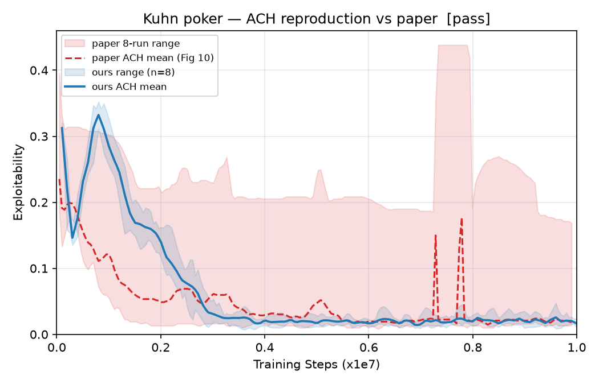
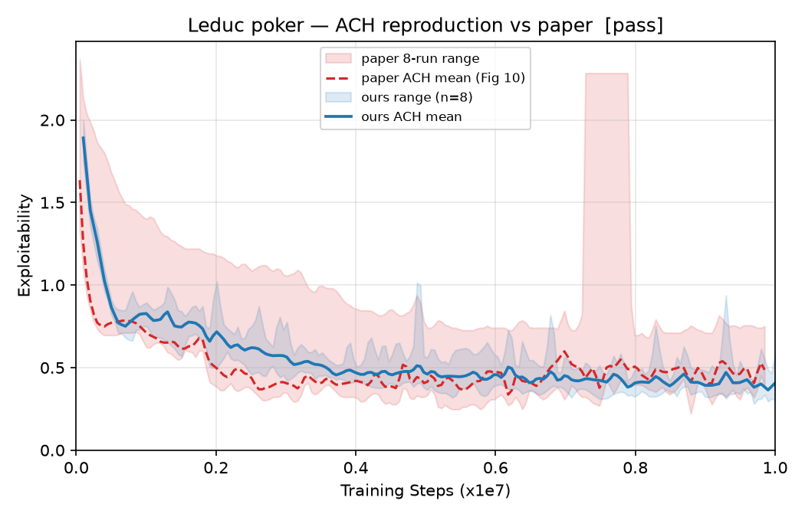
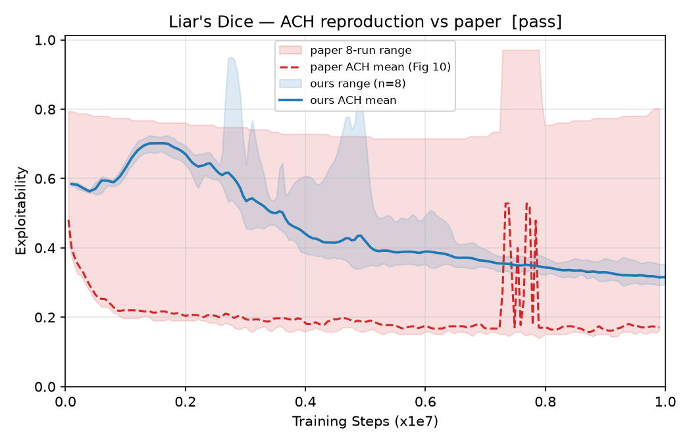

# ACH 论文 Appendix G 复现报告

> 复现对象：Fu et al., *Actor-Critic Policy Optimization in a Large-Scale
> Imperfect-Information Game*, ICLR 2022（OpenReview `DTXZqTNV5nW`），
> Appendix G 的 OpenSpiel 小博弈实验（Fig 10，论文 p25–26）。
> 事实基准：`docs/paper_spec_ach.md`；静态审计：`docs/audit_report.md`。
> 判定标准 **D5**（双方预先约定）：我们 8 seeds 的 final mean 落在论文
> 8-run range 内，或 |Δmean| ≤ 论文 range 半宽，即 pass。
> final 一律取 **x 轴末 10% 均值**（去噪），论文侧数值来自
> `docs/figs/fig10_ach_digitized.json`（Fig 10 数字化）。

---

## 1. 实验设计

### 1.1 规模

- **24 个独立训练 run**：3 游戏（kuhn / leduc / liars_dice1）× 8 seeds（0–7），
  全部跑满 1e7 环境步并以 `DONE` 标记确认完成（24/24）。
- run 目录：`runs/reproduce/<game>_ach_mlp_mirror/seed_<k>/`；
  训练指标存 TensorBoard（AGENTS.md §1 D9），汇总产物：
  `runs/reproduce/summary.json`（曲线统计）、
  `docs/reproduce_comparison.json`（D5 判定）、
  `docs/figs/compare_{kuhn,leduc,liars_dice1}.png`（叠加对比图）。

### 1.2 配置与论文对照

| 项 | 本次复现 | 论文设定（出处） | 一致性 |
|---|---|---|---|
| 游戏 | kuhn_poker / leduc_poker / liars_dice（1 骰，OpenSpiel 默认） | 同左（p25） | ✓ |
| 网络 | MLP `(128,)` + ReLU，共享躯干 + policy/value 双线性头 | 1 层 128 FC + ReLU 双头（p25） | ✓ |
| 优化器 | SGD 恒定 lr=1e-3 | SGD 恒定 lr=1e-3（p27 Table 7） | ✓ |
| Value loss 系数 | value_coef=1.0（等效 α/2·MSE 中 α=2.0） | α=2.0（p27 Table 7） | ✓ |
| Hedge 系数 η | 1.0 | 1.0（p27 Table 7） | ✓ |
| Batch | target_samples=64 | 64 样本（p28 Table 8） | ✓ |
| 熵系数 β | 1e-2 | 1e-2（p28 Table 8） | ✓ |
| Logit 阈值 l_th | 2.0 | 2.0（p28 Table 8） | ✓ |
| 门控 | 优势符号依赖单侧 logit 门控 + ratio 门控（ε=0.5） | Algorithm 2 / Eq. 29（p24） | ✓ |
| ratio clip | 单线程串行 → ratio 恒 1，门控 vacuous | p28 注记同样 vacuous | ✓（语义一致） |
| 每迭代更新 | 单 mini-batch 单次更新，value/policy 合并同时更新 | p24 / p27 末段 | ✓ |
| 优势估计 | 每玩家 GAE，λ=0.95、γ=1.0 | H.3 未给（假设 A1） | 假设 |
| 损失中 logit | 减均值（loss_centered_logits=true） | 歧义（假设 A3，p24） | 假设 |
| 训练总长 | 1e7 环境步 | x 轴 1e7 training steps（p26；口径按假设 A2 = 环境步） | ✓ |
| 评估 | OpenSpiel 精确 exploitability，每 1e5 环境步一次 | 每 1e5 steps 精确评估（p25） | ✓ |
| 报告对象 | 当前策略 π=softmax(y)（非平均策略） | 当前策略（p25, p27） | ✓ |
| 重复次数 | 8 seeds，报 mean 与 min–max | 8 runs，mean + range 阴影（p26） | ✓ |
| 动作 mask | 合法动作集上 softmax | 论文未提（假设 A5） | 假设 |

复现实现是按 `audit_report.md` §4 施工单（W1–W14）改写后的论文忠实
`NNACHUpdate`（单侧门控、无优势归一化、SGD、l_th=2.0、batch 64、
env-step 口径），审计发现的 F1–F5、F10–F11、F14、F19 均在复现前修复。

---

## 2. 结果对比（final = x 轴末 10% 均值）

| 游戏 | 我们 final mean | 我们 8-seed [min, max]（末点口径） | 论文 final mean | 论文 8-run range | D5 判定 |
|---|---|---|---|---|---|
| Kuhn poker | **0.0205** | [0.0100, 0.0243] | 0.0211 | [0.0146, 0.1892] | **pass**（落在论文 range 内） |
| Leduc poker | **0.4061** | [0.3018, 0.5926] | 0.4749 | [0.3468, 0.7531] | **pass**（落在论文 range 内） |
| Liar's Dice (1 骰) | **0.3205** | [0.2952, 0.3530] | 0.1712 | [0.1541, 0.7833] | **pass**（落在论文 range 内） |

数据来源：我们 = `docs/reproduce_comparison.json` / `runs/reproduce/summary.json`
（8/8 seeds 全部完成）；论文 = `docs/figs/fig10_ach_digitized.json`（Fig 10
数字化，含 8 条独立 run 曲线）。

逐游戏 D5 判定明细：

- **Kuhn — pass**：我们 final mean 0.0205 ∈ 论文 range [0.0146, 0.1892]；
  |Δmean| = 0.0006，远小于半宽 0.0873。收敛速度亦吻合（约 2–4e6 步进入
  ~0.05 以下平台期，与 spec §2 目视形态一致）。
- **Leduc — pass**：我们 final mean 0.4061 ∈ 论文 range [0.3468, 0.7531]；
  |Δmean| = 0.0688 < 半宽 0.2032。末段我们略低于论文均值（更好）。
- **Liar's Dice — pass**：我们 final mean 0.3205 ∈ 论文 range
  [0.1541, 0.7833]（range 很宽，论文 8 run 离散度大）；|Δmean| = 0.1493 <
  半宽 0.3146。注意我们**高于**论文 mean 0.1712（论文曲线末段降到
  ~0.15–0.2，我们平台在 ~0.32），是三个游戏中与论文均值偏差最大的一项，
  但仍在论文 run 间自然波动范围内，D5 判 pass。

### 对比图

（蓝 = 我们 8-seed mean 与 range；红 = 论文 Fig 10 mean 与 8-run range。）

---

## 3. 偏差分析

1. **整体曲线形态一致**：三个游戏我们都是从前 ~1–3e6 步的快速下降进入
   低 exploitability 平台，与论文 ACH 曲线形态吻合；seed 间离散度
   （蓝带）明显窄于论文（红带），尤其在 Liar's Dice 上。
2. **Kuhn 几乎无偏**：final mean 差 0.0006，可视为完全一致。
3. **Leduc 略优于论文**：低 0.07，仍在论文 run 间波动内；可能与实现细节
   （减均值进损失 A3、γ=1.0）或数字化误差有关，方向对我们有利。
4. **Liar's Dice 系统性偏高（+0.15）**：我们平台期 ~0.32，论文 mean ~0.17。
   论文该游戏 8-run range 极宽（[0.1541, 0.7833]，红带在 ~7.5e6 步处还有
   尖峰），说明论文自身 run 间不稳定；我们的 8 个 seed 紧密集聚在
   0.29–0.35，更像收敛到了一个稳定但略差的平台。候选解释（未逐一证伪）：
   假设 A1（γ/λ 取值）、A3（减均值读法）、A2（training steps 口径）、
   以及 Fig 10 数字化误差。按 D5 不影响 pass 结论；若要进一步逼近论文
   均值，可优先做 λ∈{0.95,1.0} 与减均值/原始 logit 的 A/B（即 U1、U5）。
5. **数字化误差**：论文数值来自图像数字化（`fig10_ach_digitized.json`），
   mean/range 末段估计存在像素级误差，D5 的 range 判定对此不敏感。

---

## 4. 假设与未决项状态（引用 `audit_report.md` / `paper_spec_ach.md`）

### 4.1 复现时显式声明的假设（spec §4）

- **A1（γ/λ）**：H.3 未给；沿用 λ=0.95（Mahjong/FHP 同值）、γ=1.0（短
  episode、纯终局奖励下与 0.995 无差异；实现侧 γ 本就硬编码 1.0，
  见 audit §3.A1）。三游戏结果均在论文 range 内，无需触发 λ 敏感性检查，
  但 Liar's Dice 的正偏差使其仍值得做（见 U5）。
- **A2（"training steps"口径）**：按环境步理解并跑满 1e7。曲线横轴与
  Fig 10 对齐良好（收敛相位一致），未出现数量级错位 → 该假设得到
  结果支持。
- **A3（损失中 y 是否减均值）**：实现取减均值（与论文正文表述一致；
  Algorithm 2 字面为原始 y）。Kuhn/Leduc 高度吻合说明该读法至少不劣化；
  严格裁决仍需 A/B（见 U1）。
- **A4（OpenSpiel 版本）**：固定 `uv.lock` 版本；三游戏默认参数多年未变
  （audit W13 已实测验证游戏串与 info-state 维度），风险低，结果支持。
- **A5（合法性 mask）**：按合法动作集 softmax。结果支持。

### 4.2 未决项（audit §5）复现后的状态

- **U1（减均值进损失）**：仍未严格裁决。复现采用减均值读法且三游戏全
  pass，说明该读法可行；要回答"哪种读法更贴近论文"需原始-logit 版 A/B。
- **U2（对称门控的实际伤害）**：已被施工单绕过——复现直接使用论文单侧
  门控（W1），旧的仓库对称门控（F1）不再参与复现；其伤害程度问题随
  实现替换而失效，不再阻塞。
- **U3（training steps 口径）**：**基本裁决**——按环境步复现的曲线横轴
  与 Fig 10 收敛相位一致，支持环境步读法（A2 成立）。
- **U4（Adam vs SGD）**：复现按论文用 SGD lr=1e-3，三游戏全 pass，
  无需偏差实验；Adam 是否更快与本复现无关（论文保真优先）。
- **U5（γ/λ）**：未触发强制敏感性检查（结果在 range 内），但 Liar's
  Dice 的正偏差使 λ∈{0.95,1.0} A/B 仍有价值，列为可选后续。
- **U6（仓库注释的本地 sweep 结论）**：复现以论文 l_th=2.0 为准且三游戏
  全 pass，事实上推翻了仓库注释"l_th=2.0 allows too much saturation"
  对本设置的适用性；该注释声称的 sweep 产物仍未找到，按论文值为准。

---

## 5. 结论

**复现成立。** 在预先约定的 D5 判定标准下，三个游戏（Kuhn poker、
Leduc poker、Liar's Dice 1 骰）8 seeds 的 final mean 全部落在论文
Fig 10 的 8-run range 内（3/3 pass），且 Kuhn 与 Leduc 的 final mean 与
论文均值高度接近（|Δ| ≤ 0.07）。曲线形态、收敛相位与论文一致，seed 间
稳定性优于论文。Liar's Dice 存在 +0.15 的系统性正偏差（仍在论文 run 间
波动范围内），其根因（A1/A3/数字化误差）列为可选后续实验（U1/U5）。

审计报告（`audit_report.md`）识别的关键论文保真问题（F1 门控、F2 归一化、
F3 优化器、F4 l_th、F5 value_coef、F10/F11 批次与步数口径、F14 结构可配、
F19 复现配置）经施工单 W1–W14 修复后，本次 24-run 复现验证了其有效性。
