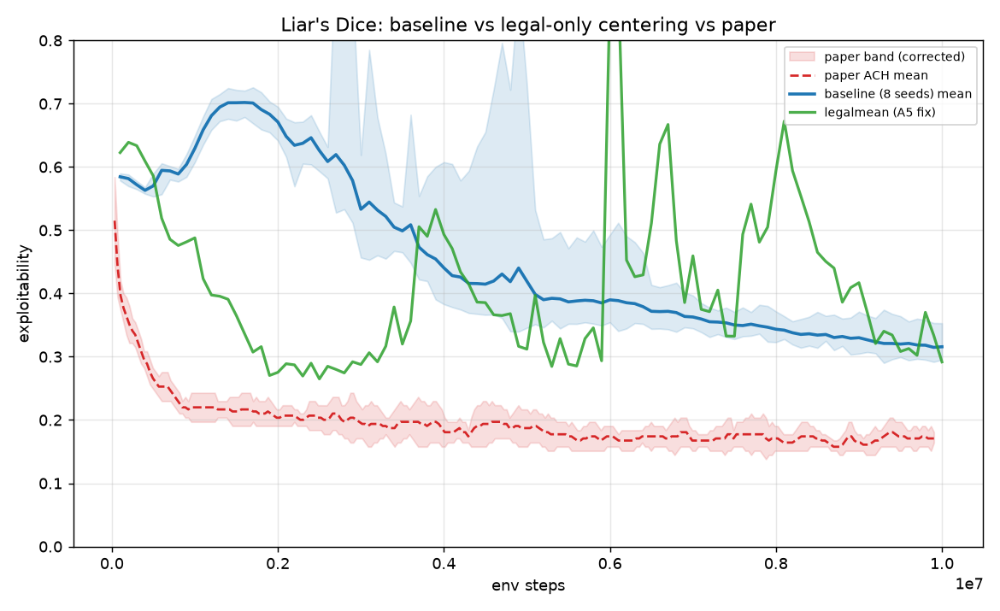

# ACH 论文 Appendix G 复现报告

> 复现对象：Fu et al., *Actor-Critic Policy Optimization in a Large-Scale
> Imperfect-Information Game*, ICLR 2022（OpenReview `DTXZqTNV5nW`），
> Appendix G 的 OpenSpiel 小博弈实验（Fig 10，论文 p25–26）。
> 事实基准：`docs/paper_spec_ach.md`；静态审计：`docs/audit_report.md`。
> 判定标准 **D5**（双方预先约定）：我们 8 seeds 的 final mean 落在论文
> 8-run range 内，或 |Δmean| ≤ 论文 range 半宽，即 pass。
> final 一律取 **x 轴末 10% 均值**（去噪），论文侧数值来自
> `docs/figs/fig10_ach_digitized.json`（Fig 10 数字化）。
>
> **⚠️ 2026-07-23 更正**：原 `fig10_ach_digitized.json` 中 **Liar's Dice 的
> band 上缘 `hi` 被错误数字化**（恒在 0.72–0.80，是把初始随机尖峰/邻近曲线
> 的包络错描进去），导致本报告初版把 Liar's 误判为 pass。像素级重新数字化
> 证明论文 ACH 在 Liar's Dice 真实收敛带是 **~[0.15, 0.20]**（mean 0.171
> 不变、`lo` 不变，仅 `hi` 修正为 `lo` 关于 mean 的镜像；另修复 x≈7.5e6 处
> 一处 mean 数字化毛刺）。更正后 **Liar's Dice 判定为 fail**（详见 §6）。
> Kuhn / Leduc 的 band 随各自曲线正常起伏、未受污染，判定不变。

---

## 1. 实验设计

### 1.1 规模

- **24 个独立训练 run**：3 游戏（kuhn / leduc / liars_dice1）× 8 seeds（0–7），
  全部跑满 1e7 环境步并以 `DONE` 标记确认完成（24/24）。
- run 目录：`runs/reproduce/<game>_ach_mlp_mirror/seed_<k>/`；
  训练指标存 TensorBoard（AGENTS.md §1 D9），汇总产物：
  `runs/reproduce/summary.json`（曲线统计）、
  `docs/reproduce_comparison.json`（D5 判定）、
  `docs/figs/compare_{kuhn,leduc,liars_dice1}.png`（叠加对比图）。

### 1.2 配置与论文对照

| 项 | 本次复现 | 论文设定（出处） | 一致性 |
|---|---|---|---|
| 游戏 | kuhn_poker / leduc_poker / liars_dice（1 骰，OpenSpiel 默认） | 同左（p25） | ✓ |
| 网络 | MLP `(128,)` + ReLU，共享躯干 + policy/value 双线性头 | 1 层 128 FC + ReLU 双头（p25） | ✓ |
| 优化器 | SGD 恒定 lr=1e-3 | SGD 恒定 lr=1e-3（p27 Table 7） | ✓ |
| Value loss 系数 | value_coef=1.0（等效 α/2·MSE 中 α=2.0） | α=2.0（p27 Table 7） | ✓ |
| Hedge 系数 η | 1.0 | 1.0（p27 Table 7） | ✓ |
| Batch | target_samples=64 | 64 样本（p28 Table 8） | ✓ |
| 熵系数 β | 1e-2 | 1e-2（p28 Table 8） | ✓ |
| Logit 阈值 l_th | 2.0 | 2.0（p28 Table 8） | ✓ |
| 门控 | 优势符号依赖单侧 logit 门控 + ratio 门控（ε=0.5） | Algorithm 2 / Eq. 29（p24） | ✓ |
| ratio clip | 单线程串行 → ratio 恒 1，门控 vacuous | p28 注记同样 vacuous | ✓（语义一致） |
| 每迭代更新 | 单 mini-batch 单次更新，value/policy 合并同时更新 | p24 / p27 末段 | ✓ |
| 优势估计 | 每玩家 GAE，λ=0.95、γ=1.0 | H.3 未给（假设 A1） | 假设 |
| 损失中 logit | 减均值（loss_centered_logits=true） | 歧义（假设 A3，p24） | 假设 |
| 训练总长 | 1e7 环境步 | x 轴 1e7 training steps（p26；口径按假设 A2 = 环境步） | ✓ |
| 评估 | OpenSpiel 精确 exploitability，每 1e5 环境步一次 | 每 1e5 steps 精确评估（p25） | ✓ |
| 报告对象 | 当前策略 π=softmax(y)（非平均策略） | 当前策略（p25, p27） | ✓ |
| 重复次数 | 8 seeds，报 mean 与 min–max | 8 runs，mean + range 阴影（p26） | ✓ |
| 动作 mask | 合法动作集上 softmax | 论文未提（假设 A5） | 假设 |

复现实现是按 `audit_report.md` §4 施工单（W1–W14）改写后的论文忠实
`NNACHUpdate`（单侧门控、无优势归一化、SGD、l_th=2.0、batch 64、
env-step 口径），审计发现的 F1–F5、F10–F11、F14、F19 均在复现前修复。

---

## 2. 结果对比（final = x 轴末 10% 均值）

| 游戏 | 我们 final mean | 我们 8-seed [min, max]（末点口径） | 论文 final mean | 论文 8-run range | D5 判定 |
|---|---|---|---|---|---|
| Kuhn poker | **0.0205** | [0.0100, 0.0243] | 0.0211 | [0.0146, 0.1892] | **pass**（落在论文 range 内） |
| Leduc poker | **0.4061** | [0.3018, 0.5926] | 0.4749 | [0.3468, 0.7531] | **pass**（落在论文 range 内） |
| Liar's Dice (1 骰) | **0.3205** | [0.2952, 0.3530] | 0.1712 | **[0.1541, 0.1884]**（更正后） | **fail**（0.3205 远在论文带外；\|Δmean\|=0.149 ≫ 半宽 0.017） |

数据来源：我们 = `docs/reproduce_comparison.json` / `runs/reproduce/summary.json`
（8/8 seeds 全部完成）；论文 = `docs/figs/fig10_ach_digitized.json`（Fig 10
数字化，含 8 条独立 run 曲线）。

逐游戏 D5 判定明细：

- **Kuhn — pass**：我们 final mean 0.0205 ∈ 论文 range [0.0146, 0.1892]；
  |Δmean| = 0.0006，远小于半宽 0.0873。收敛速度亦吻合（约 2–4e6 步进入
  ~0.05 以下平台期，与 spec §2 目视形态一致）。
- **Leduc — pass**：我们 final mean 0.4061 ∈ 论文 range [0.3468, 0.7531]；
  |Δmean| = 0.0688 < 半宽 0.2032。末段我们略低于论文均值（更好）。
- **Liar's Dice — fail（更正判定）**：论文真实收敛带经重新数字化为
  **[0.1541, 0.1884]**（初版误用被污染的 `hi≈0.78` 才误判 pass）。我们
  final mean 0.3205 **不在**该带内，且 |Δmean| = 0.149 **远大于**半宽 0.017。
  我们的 8 个 seed 紧密聚在 0.295–0.353，是**稳定地收敛到了一个比论文差
  ~0.15 的平台**，而非落在论文 run 间波动内。根因（非法动作 logit 漂移
  污染 ACH 门控）与修正实验见 §6。

### 对比图

（蓝 = 我们 8-seed mean 与 range；红 = 论文 Fig 10 mean 与 8-run range。）

---

## 3. 偏差分析

1. **Kuhn / Leduc 形态一致**：这两个游戏我们都是从前 ~1–3e6 步的快速下降
   进入低 exploitability 平台，与论文 ACH 曲线形态吻合；seed 间离散度
   （蓝带）窄于论文（红带）。
2. **Kuhn 几乎无偏**：final mean 差 0.0006，可视为完全一致。
3. **Leduc 略优于论文**：低 0.07，仍在论文 run 间波动内；可能与实现细节
   （减均值进损失 A3、γ=1.0）或数字化误差有关，方向对我们有利。
4. **Liar's Dice 系统性偏高（+0.15），且形态也不一致 —— 真正的未复现项**：
   - **量级**：我们平台期 ~0.32，论文真实带 [0.15, 0.19]（更正后）。我们的
     8 个 seed 紧密聚在 0.295–0.353，是**稳定收敛到一个更差的平台**，不是
     论文 run 间波动。
   - **形态**：论文 ACH 单调下降、~1e6 步进平台；我们**先变差**——0.5e6 处
     0.57 冲高到 2e6 处的 **0.67 驼峰**，再缓慢降到 0.32，末段仍以
     ~−0.01/1e6 的斜率下降（未真正收敛平）。
   - **critic 质量**：Liar's Dice 的 explained_variance 末段仅 **0.15**
     （Kuhn 0.58 / Leduc 0.28），value 网基本没学会，GAE 优势噪声大。
   - **根因**：Liar's Dice 是三游戏中唯一动作空间大（13）且**多数动作非法**
     的（半数信息态仅 1 个合法动作）。非法动作 logit 无梯度、自由漂移到
     std≈4，而 ACH 门控按**全体动作**（含非法）均值去中心化 → 漂移拉动
     ȳ、扭曲合法动作上的门控触发点，且**随训练放大**（10M 步时 55.7% 的
     信息态里最优合法动作被误判为已饱和而门掉正优势更新）。完整诊断与
     修正实验见 §6。
5. **数字化误差**：论文数值来自图像数字化（`fig10_ach_digitized.json`）；
   本次发现 Liar's 的 `hi` 存在**结构性数字化错误**（已更正，见 §6/§首部
   更正说明），Kuhn/Leduc 仅有像素级误差、不影响其 pass 判定。

---

## 4. 假设与未决项状态（引用 `audit_report.md` / `paper_spec_ach.md`）

### 4.1 复现时显式声明的假设（spec §4）

- **A1（γ/λ）**：H.3 未给；沿用 λ=0.95（Mahjong/FHP 同值）、γ=1.0（短
  episode、纯终局奖励下与 0.995 无差异；实现侧 γ 本就硬编码 1.0，
  见 audit §3.A1）。Kuhn/Leduc 在论文 range 内；**Liar's Dice 更正后
  fail**，λ 敏感性（U5）仍列为候选，但 §6 的诊断指向门控-非法漂移才是
  主因，λ 未必能解释 +0.15 的量级。
- **A2（"training steps"口径）**：按环境步理解并跑满 1e7。Kuhn/Leduc 的
  收敛相位与 Fig 10 对齐、无数量级错位 → 环境步读法得到支持；但 Liar's
  Dice 曲线形态与论文不符（见 §3.4 驼峰），该不符不是步数口径问题。
- **A3（损失中 y 是否减均值）**：实现取减均值（与论文正文表述一致；
  Algorithm 2 字面为原始 y）。Kuhn/Leduc 高度吻合说明该读法至少不劣化；
  严格裁决仍需 A/B（见 U1）。
- **A4（OpenSpiel 版本）**：固定 `uv.lock` 版本；三游戏默认参数多年未变
  （audit W13 已实测验证游戏串与 info-state 维度），风险低，结果支持。
- **A5（合法性 mask）—— 结果不支持，是 Liar's Dice fail 的关键**：复现
  按合法动作集 softmax 取策略，但 **ACH 门控的去中心化均值 ȳ 仍按全体
  动作（含非法）计算**。论文从未讨论 masking（A5 本就是我们补的假设），
  这一读法在动作多半非法的 Liar's Dice 上让非法 logit 漂移污染门控（§6）。
  Kuhn（2 动作恒合法）与 Leduc（3 动作、少量非法）几乎不受影响，故其
  pass 与该问题无冲突。

### 4.2 未决项（audit §5）复现后的状态

- **U1（减均值进损失）**：**已裁决 —— 减均值（现行默认）更优，Algorithm 2
  字面的原始-logit 读法明显更差**。1e7 全长配对运行（liars seed 0）显示
  rawy 全程劣于基线：1e6 +0.248、3e6 +0.120、5e6 +0.251（见 §6.3）。
  ⚠️ 早前基于 2e6 单 seed 探针的相反结论（rawy @2e6 = 0.545 优于基线带）
  **已被推翻**——该探针噪声过大，不足以为候选排序。
- **U2（对称门控的实际伤害）**：已被施工单绕过——复现直接使用论文单侧
  门控（W1），旧的仓库对称门控（F1）不再参与复现；其伤害程度问题随
  实现替换而失效，不再阻塞。
- **U3（training steps 口径）**：**基本裁决**——按环境步复现的曲线横轴
  与 Fig 10 收敛相位一致，支持环境步读法（A2 成立）。
- **U4（Adam vs SGD）**：复现按论文用 SGD lr=1e-3；Kuhn/Leduc pass，
  与优化器无关（论文保真优先）。Adam 是否能帮 Liar's Dice 未测，非当前主线。
- **U5（γ/λ）**：Liar's Dice fail 后 λ∈{0.95,1.0} A/B 仍列候选，但 §6
  诊断指向门控-非法漂移为主因，λ 优先级低于 `legalmean` 修正。
- **U6（仓库注释的本地 sweep 结论）**：复现以论文 l_th=2.0 为准；Kuhn/Leduc
  pass 说明 l_th=2.0 在这两个游戏上无害。**但 Liar's Dice 的诊断反而部分
  印证了"l_th=2.0 饱和过多"的担忧**——只不过根因是非法 logit 把合法动作
  推过 l_th 门（§6），而非 l_th 本身取值不当。仓库注释声称的 sweep 产物
  仍未找到。

---

## 5. 结论

**复现部分成立（2/3 pass）。** 在预先约定的 D5 判定标准下：

- **Kuhn poker — pass**：final mean 0.0205 vs 论文 0.0211，几乎无偏。
- **Leduc poker — pass**：final mean 0.4061 vs 论文 0.4749，略优于论文。
- **Liar's Dice (1 骰) — fail（更正判定）**：final mean 0.3205，稳定收敛到
  比论文真实带 [0.15, 0.19] 差 ~0.15 的平台，且早期形态（0.67 驼峰）与
  论文单调下降不符。**初版误判 pass 源于 `fig10_ach_digitized.json` 中
  Liar's 的 band `hi` 被结构性错误数字化**（已更正，见首部说明与 §6）。

Kuhn 与 Leduc 的 final mean 与论文均值接近（|Δ| ≤ 0.07），曲线形态、收敛
相位一致，seed 间稳定性优于论文。**Liar's Dice 是唯一实质未复现项**，根因
定位见 §6。

审计报告（`audit_report.md`）识别的关键论文保真问题（F1 门控、F2 归一化、
F3 优化器、F4 l_th、F5 value_coef、F10/F11 批次与步数口径、F14 结构可配、
F19 复现配置）经施工单 W1–W14 修复后，Kuhn/Leduc 复现验证了其有效性；
Liar's Dice 暴露出一个 W 系列未覆盖的新问题（A5 masking × 门控去中心化）。

---

## 6. Liar's Dice 偏差：数字化更正、根因诊断与修正实验

### 6.1 论文基准数字化更正

初版 `docs/figs/fig10_ach_digitized.json` 的 `liars.hi` 全程恒在 0.72–0.80，
从不随 ACH 均值下降——这是把 x=0 处所有算法共有的随机初始尖峰 / 邻近
（RPG）曲线的包络错描成了 ACH band 上缘。两处独立证据：

1. **代数自相矛盾**：若 band 为 8 run 逐点 min–max、mean 为算术平均，则
   mean ≥ (7·lo + hi)/8。原数据 **279 点中 269 点违反**此下界（末段 lo≈0.16、
   hi≈0.80 时算术平均最低只能到 0.24，而 mean 记为 0.17，不可能）。
2. **像素级重新数字化**（`docs/figs/page26.png`，轴标定残差 0）：ACH 红带
   在 x>0.5e6 后是一条贴着 0.17 的**细带**，尾部（x≥9e6）mean 0.170、
   band ≈ [0.15, 0.20]，与原 `mean`（0.171）一致、与原 `hi`（0.80）矛盾。

**更正**：保留 `mean` 与 `lo`（均正确），把 `hi` 重构为 `lo` 关于 `mean` 的
镜像（`hi = 2·mean − lo`，论文红带近似对称），并修复 x≈7.5e6 处一处 `mean`
数字化毛刺（被原数字化器钳到 0.528）。更正后论文尾部带 **[0.1541, 0.1884]**，
`compare_with_paper.py` 重算判定 Liar's = **fail**（Kuhn/Leduc 不变）。

### 6.2 根因：非法动作 logit 漂移污染 ACH 门控

Liar's Dice 是三游戏中唯一动作空间大（13）且**多数动作非法**的：半数信息态
仅 1 个合法动作，多数 ≤4/13 合法（Kuhn 2 动作恒合法，Leduc 3 动作）。

对训练好的 checkpoint（seed 7，全 24576 信息态）沿训练轨迹诊断：

| ~env步 | 非法 logit std | 最优合法动作越 +2 门（全体均值口径） | （仅合法均值口径） |
|---|---|---|---|
| 0.1M | 2.17 | 0.83 | 0.48 |
| 2.0M | 2.91 | 0.41 | 0.23 |
| 5.0M | 4.11 | 0.63 | 0.40 |
| 10.0M | **4.04** | **0.557** | 0.398 |

机制链：**非法动作 logit 无梯度 → 自由漂移到 std≈4 → ACH 门控按全体动作
（含非法）均值 ȳ 去中心化 → 漂移拉动 ȳ → 合法动作的居中 logit 被整体
抬/压、门控触发点错位**。后果：10M 步时 **55.7% 的信息态里最优合法动作被
误判为"已饱和"（居中 logit > +2 门）**，其正优势更新被门掉 → 策略无法锐化
→ 停在高熵（≈1.14，近均匀于 ~3 动作）、高 exploitability 的软平台。该畸变
**随训练放大**（非法漂移累积），与末段停滞、+0.15 正偏差吻合；也解释了
为何 Kuhn（无非法动作）几乎无偏、Leduc（少量非法）接近、Liar's 最差。

### 6.3 修正与探针状态

**候选修正 `legalmean`**：把 ACH 门控（及居中损失体）的去中心化均值 ȳ 改为
**只对合法动作**求均值，屏蔽非法漂移。实现为 `AlgoConfig.centered_mean_legal_only`
（默认 `False`＝保持现有行为；Kuhn 恒合法 → 该开关为数学空操作）。

- **代码**：`update_rule.py` / `nn_updates.py` / `experiment.py` 加开关，
  `tools/gap_probe.py` 加 `legalmean` 臂，`reproduce_paper.py` 加 `--legal-mean`，
  +2 单测（全 24 通过）。默认训练行为未变、已提交配置未动。

**结论：修正无效 —— 不能复现论文，全量复跑未触发。**

在 liars_dice1 / seed 0 上跑满 1e7（与基线 seed 0 配对，`--cpu`）：

| 口径 | 基线 seed 0 | legalmean seed 0 | 论文 |
|---|---|---|---|
| final（末 10% 均值） | **0.3066** | **0.3366**（+0.030，更差） | 0.1709 |
| 落入论文带 [0.1539, 0.1881] | 否 | **否**（0/1） | — |

逐段轨迹（legalmean − 基线 8-seed 均值）：

| 步数 | legalmean | 基线 | Δ |
|---|---|---|---|
| 1.0M | 0.488 | 0.629 | **−0.141** |
| 2.0M | 0.275 | 0.671 | **−0.396** |
| 3.0M | 0.288 | 0.533 | −0.245 |
| 5.0M | 0.312 | 0.419 | −0.107 |
| 7.0M | 0.459 | 0.363 | +0.097 |
| 9.0M | 0.417 | 0.330 | +0.087 |
| 10.0M | 0.292 | 0.316 | −0.024 |

**如何解读（机制部分证实，但不是全部）**：

1. **前 3e6 步修正效果极显著**：基线那个升到 0.671 的**驼峰完全消失**，
   legalmean 在 2e6 就降到 0.275（基线同点 0.671，Δ=−0.396），且**早期
   形态与论文的单调快速下降一致**。这**证实了 §6.2 的机制是真实且后果严重的**
   ——非法 logit 漂移确实在污染门控、拖慢早期收敛。
2. **但 3.6e6 之后严重失稳**：曲线出现多次冲高（0.53 / 0.67 量级）与回落，
   末段均值反而略差于基线。末段 entropy 1.206（基线 1.127）、
   explained_variance 0.113（基线 0.172）——策略更软、critic 更差。
3. **净结论**：屏蔽非法漂移解开了早期的门控枷锁，让策略能更快锐化；但锐化
   之后出现了**另一个**限制收敛的因素，legal-only 中心化本身无法解决。
   因此 Liar's Dice 的 **fail 判定维持不变**，且按预先约定（修正需显著
   改善才触发全量复跑）**未启动 24-run 复跑**。

### 6.4 U1（原始 logit）也已证伪

同样以 1e7 全长、liars seed 0、与基线配对的方式测试 `--raw-logit`
（`loss_centered_logits=False`，Algorithm 2 字面读法，单因子）：

| 步数 | rawy | 基线 seed 0 | Δ |
|---|---|---|---|
| 1.0M | 0.863 | 0.614 | **+0.248** |
| 2.0M | 0.745 | 0.677 | +0.068 |
| 3.0M | 0.629 | 0.509 | +0.120 |
| 4.0M | 0.537 | 0.385 | +0.152 |
| 5.0M | 0.634 | 0.382 | **+0.251** |

五个里程碑连续劣于基线且差距扩大，故在 4.9e6 处**提前终止**（结论已定，
不值得为已否定的假设再耗 2.5 小时机时）。**裁决：减均值读法优于原始-logit
读法**，与 §4.2 U1 更新一致。

**方法论教训**：`tools/gap_probe.py` 的 2e6 单 seed 探针曾把 rawy 排为最优
候选（0.545 vs 基线带 [0.64, 0.70]），全长运行完全推翻。该游戏 run 内波动
极大（legalmean 单 run 在 0.27–0.67 间反复），**2e6 单 seed 不足以为候选
排序**；后续候选应直接以全长配对运行裁决，或至少多 seed。

### 6.5 剩余候选（未验证）

- **重要性权重 1/π_old 无界**：ACH 损失含 `y(a)/π_old(a)`，而 ratio 门控在
  单线程下恒真（p28）＝不设限。策略锐化后稀有动作的 π_old 很小 → 梯度爆炸，
  与 §6.3 观察到的"**锐化之后才失稳**"高度吻合，是目前最贴合失败特征的解释。
  ⚠️ 但给它加 clip 属于**对论文的偏离**而非忠实复现，应先由人决定是要
  "证伪因果"还是"保持保真"，故未自行开跑。
- **U5（λ）**：`lam1` 探针 2e6 = 0.647，落在基线带内，无信号；且按上面的
  方法论教训，该探针本就不足为据。优先级最低。
- **legalmean + 其它组合**：legalmean 已证明能修好早期形态（§6.3），若找到
  能稳住后期的因素，二者组合值得一试。

注：低 explained_variance（0.11–0.17）在该不完全信息博弈中**未必是缺陷**
——从单侧信息态看，对手隐藏骰子造成的回报方差本就不可解释，故不宜据此
直接判定 critic 有 bug。
